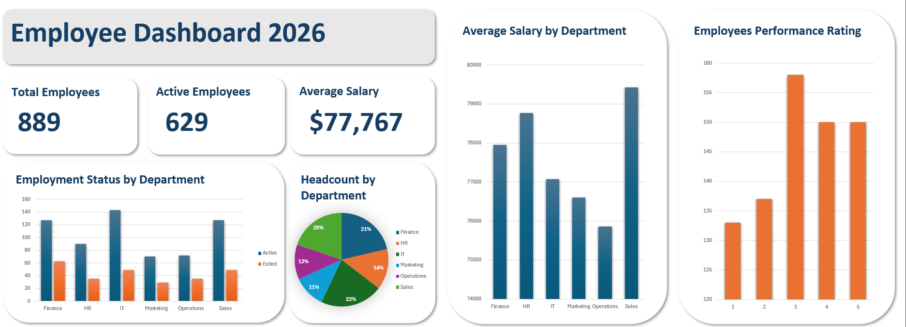

# HR Analytics Dashboard — Excel Project

## Overview
This project simulates a real-world HR analytics workflow for an organization of 889 employees.
The goal was to clean a messy HR dataset, analyze workforce composition and turnover trends 
across departments, and present findings in an executive-ready dashboard — all built in 
Microsoft Excel.

## Workbook Structure

| Sheet | Description |
|---|---|
| `Raw Data` | Original dataset with inconsistencies and errors |
| `Clean Data` | Standardized and validated dataset ready for analysis |
| `Analysis Pivots` | Pivot tables summarizing key HR metrics |
| `Dashboard` | Visual summary of workforce insights |

## Tools & Concepts
- **Microsoft Excel**
- **Skills demonstrated:** Data cleaning, pivot tables, GETPIVOTDATA, 
  calculated fields, bar charts, pie charts, KPI cards, and dashboard design

## Data Cleaning
The raw dataset contained multiple inconsistencies that were identified and corrected:
- Inconsistent gender values (`f`, `FEMALE`, `Female`, `M`, `Male`) → standardized to `Male` / `Female`
- Department name typos (`Sals`, `finace`, `it`) → corrected to proper names
- Role name inconsistencies (`mgr`, `Spacialist`, `Sr Analyst`) → standardized across all records
- Added a derived `Employment Status` column (`Active` / `Exited`) based on exit date presence

## Formulas Used
- **Turnover Rate:**
- =GETPIVOTDATA("Employee ID",$A$23,"Employment Status","Exited")
/GETPIVOTDATA("Employee ID",$A$23)
Used to dynamically pull exited and total employee counts directly from the pivot table 
to calculate an accurate, auto-updating turnover rate.

## Key Metrics

| Metric | Value |
|---|---|
| Total Employees | 889 |
| Active Employees | 629 |
| Exited Employees | 260 |
| Overall Turnover Rate | 29.25% |
| Average Salary (Active) | $78,427 |
| Average Salary (Exited) | $76,175 |

## Dashboard Highlights
The dashboard provides an at-a-glance summary of workforce health across four visuals:

- **Employment Status by Department** — grouped bar chart showing active vs. exited 
  headcount per department
- **Headcount by Department** — pie chart showing workforce distribution; 
  IT (21%) and Sales (20%) make up the largest share
- **Average Salary by Department** — bar chart showing Sales leads in average 
  compensation at ~$79,400, while Operations is lowest at ~$75,900
- **Employee Performance Rating** — bar chart showing rating distribution; 
  rating 3 has the highest count at 158 employees

  ## Dashboard Preview

## Key Findings

1. **Turnover rate of 29.25% is significantly above healthy benchmarks** (typically 10–15%), 
   signaling a company-wide retention issue
2. **Exited employees earned on average $2,252 less than active employees** — 
   suggesting compensation may be a contributing factor to attrition
3. **Finance and IT are the largest departments** yet still show notable exit numbers 
   (63 and 49 respectively), indicating the problem is not isolated to smaller teams
4. **Performance ratings are relatively evenly distributed**, with a slight concentration 
   at rating 3, suggesting a mid-performer-heavy workforce

## Files
| File | Description |
|---|---|
| `HR_Analytics_Project.xlsx` | Full workbook including raw data, cleaned data, pivot analysis, and dashboard |
